<div align="center">

<!-- ══════════════════════ DYNAMIC COMMAND BANNER ══════════════════════ -->


<br/>

<!-- ══════════════════════ TYPING HEADLINE (CYAN & VIOLET) ══════════════════════ -->
<a href="https://github.com/Aryanxp1">
  
</a>

<br/>

<!-- ══════════════════════ INTERACTIVE ACTION HUD ══════════════════════ -->
<a href="https://linkedin.com/in/aryan-vishwakarma-8973a3327/"></a>
<a href="https://leetcode.com/u/aizen_xp/"></a>
<a href="https://github.com/Aryanxp1?tab=repositories"></a>
<a href="https://vayusutra-apix.onrender.com/"></a>

<br/><br/>


</div>

<br/>

<!-- ══════════════════════ CYBER CYCLE DIVIDER ══════════════════════ -->
<div align="center">
  
</div>

<br/>

### `// EXECUTIVE DOSSIER`

> *"The quieter you become, the more you can hear."*  
> *Data is chaotic until structured; systems are fragile until bounded.*

I operate at the convergence of **AI Systems Engineering, Data Science, Machine Learning, and Quantitative Analysis**. Whether it's architecting statistically defensible price indices (Jevons/Laspeyres methodologies), hunting pipeline anomalies with local LLMs, or designing zero-dependency persistent storage engines, I build software where **every number is verifiable and every transaction is durable.**

```python
class AryanVishwakarma:
    def __init__(self):
        self.handle       = "Aryanxp1"
        self.roles        = [
            "AI Systems Engineer",
            "Data Scientist",
            "ML Practitioner",
            "Data Analyst"
        ]
        self.institution  = "Madan Mohan Malaviya University of Technology"
        self.focus_areas  = [
            "Econometric & Statistical Indexing (CPI)",
            "Predictive Modeling & Anomaly Detection",
            "Local-First AI Pipelines (Ollama / SLMs)",
            "Chaos Engineering & Fault-Tolerant Storage"
        ]
        self.dsa_record   = "Competitive Programming & Problem Solving (handle: aizen_xp)"
        self.principles   = ["Defensible Statistics", "Zero Data Loss", "Bounded Convergence"]
        self.creed        = "Code like Senku, think like Aizen"
```

<br/>

<!-- ══════════════════════ DUAL-TIER ENGINE ARCHITECTURE SVG ══════════════════════ -->
<div align="center">
  
</div>

<br/>

<!-- ══════════════════════ RETRO NEON LINE WAVE ══════════════════════ -->
<div align="center">
  
</div>

<br/>

### `// FLAGSHIP SYSTEMS & DATA PLATFORMS`

---

###  &nbsp; ✈️ [VayuSutra-APIx](https://github.com/Aryanxp1/VayuSutra-APIx)

> **Econometric Aviation Intelligence & Airfare Price Index Platform**

<p>
  <a href="https://vayusutra-apix.onrender.com/"></a>
  <a href="https://github.com/Aryanxp1/VayuSutra-APIx"></a>
  
  
</p>

- **Statistically Defensible CPI:** Built according to MoSPI CPI 2024 standards using the Jevons elementary index (geometric mean) and modified Laspeyres weighting to eliminate fare distortion.
- **Corridor Analytics:** Real-time fare volatility tracking, booking-window sensitivity, and predictive fare indices across Indian domestic aviation routes.
- **Data Trust Engine:** Automated reconciliation with DGCA reference metrics and policy simulation.

---

###  &nbsp; 🔍 [Solva](https://github.com/Aryanxp1/Solva)

> **Local-First AI Pipeline for Data Quality & Anomaly Remediation**

<p>
  <a href="https://github.com/Aryanxp1/Solva"></a>
  
  
  
  
</p>

- **Outlier & Anomaly Detection:** Real-time statistical monitoring for distribution drifts, null bursts, and schema breaks in streaming pipelines.
- **Safe Local Remediation:** Integrates local SLMs via Ollama to generate structured remediation proposals without leaking proprietary data to cloud APIs.
- **Bounded Control Loop:** Enforces strict data contracts and preview approval gates before applying dataset transformations.

---

###  &nbsp; 🛡️ [ResiliX](https://github.com/Aryanxp1/ResiliX)

> **Controlled Resilience-Testing & Chaos Engineering Platform**

<p>
  <a href="https://github.com/Aryanxp1/ResiliX"></a>
  
  
  
</p>

- **Safety-Gated Stress Injection:** Strict target allowlisting, hard duration caps, token-bucket concurrency limiters, and a global emergency killswitch.
- **Recovery Telemetry:** Benchmarks service recovery latency, tail metrics (p95/p99), and generates automated resilience scores.

---

###  &nbsp; 💾 [Forge](https://github.com/Aryanxp1/forge)

> **Zero-Dependency Local Data Engine & Storage Core**

<p>
  <a href="https://github.com/Aryanxp1/forge"></a>
  
  
  
</p>

- **Zero-Dependency Core:** Engineered from scratch using pure Python standard libraries without external ORM or database driver bloat.
- **Crash-Resistant Storage:** Write-Ahead Log (WAL) mechanics, checksum data verification, and automatic state recovery on crash.

---

<br/>

<div align="center">
  <a href="https://github.com/Aryanxp1?tab=repositories"></a>
</div>

<br/>

<!-- ══════════════════════ MIRRORED DIVIDER ══════════════════════ -->
<div align="center">
  
</div>

<br/>

### `// ALGORITHMIC MASTERY`

<div align="center">

<a href="https://leetcode.com/u/aizen_xp/">
  
</a>

<br/><br/>

<a href="https://github.com/Aryanxp1/DSA-Solutions"></a>
&nbsp;
<a href="https://github.com/Aryanxp1/Codeforces-Solution"></a>

</div>

<br/>

### `// ARSENAL & TOOLKIT`

<div align="center">

**DATA SCIENCE, ANALYTICS & MACHINE LEARNING**

<p>
  
  &nbsp;
  
  
  
  
</p>

**LANGUAGES, BACKEND & PERSISTENCE**

<p>
  
</p>

**INTERFACES, VISUALIZATION & PLATFORMS**

<p>
  
</p>

</div>

<br/>

### `// TELEMETRY & ACTIVITY`

<div align="center">


<br/><br/>

<!-- ══════════════════════ GITHUB ACTIVITY GRAPH ══════════════════════ -->


<br/><br/>

<!-- ══════════════════════ PACMAN EATING DOTS ANIMATION ══════════════════════ -->


</div>

<br/>

### `// DIRECT TRANSMISSION`

<div align="center">

**Interested in building statistically rigorous models, local AI engines, or resilient data architectures? Let's connect.**

<br/>

<a href="https://linkedin.com/in/aryan-vishwakarma-8973a3327/"></a>
&nbsp;
<a href="https://leetcode.com/u/aizen_xp/"></a>
&nbsp;
<a href="https://github.com/Aryanxp1"></a>

<br/><br/>

<!-- ══════════════════════ FOOTER SVG ══════════════════════ -->


</div>
